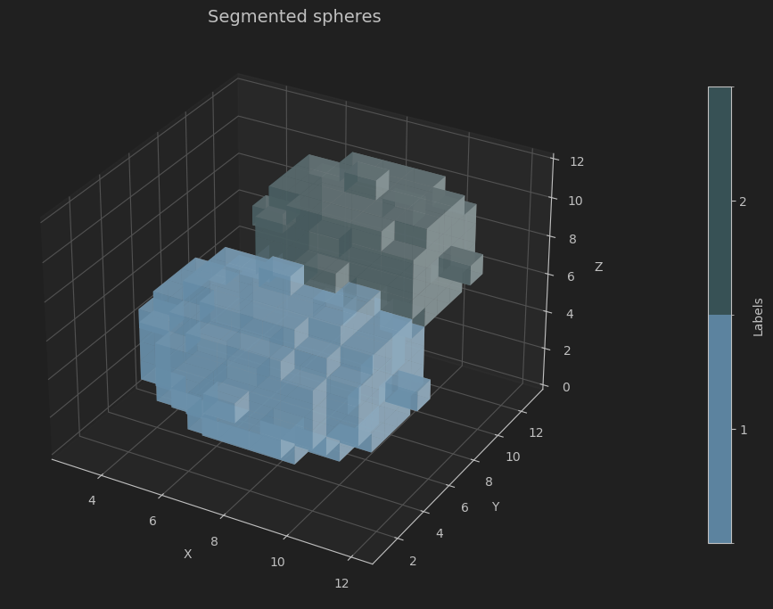

# Segmentation Lab

Image segmentation is a core technique in image analysis and computer vision, enabling us to divide an image or 3D volume into distinct, meaningful regions. This process is essential for tasks such as identifying anatomical structures in medical scans, detecting objects in autonomous driving, or analyzing materials in industrial inspection. By isolating relevant components from complex data, segmentation serves as a foundation for quantitative analysis, visualization, and decision-making in scientific and engineering workflows.

This repository offers a guided, hands-on approach to building a 3D image segmentation pipeline from scratch in Python.
 
Working with a simple synthetic volumetric dataset, learners can focus on understanding the algorithmic workflow without the complexity of real-world data. Through a series of notebooks, you’ll progress step by step through the essential stages of an image processing pipeline, culminating in a custom implementation of segmentation using classical methods such as thresholding and marker-based watershed.

Finally, the custom-built pipeline is compared against a highly optimized library implementation that leverages compiled C code for performance, illustrating the trade-offs between educational clarity and production-ready efficiency. This approach not only deepens understanding of the underlying algorithms but also highlights best practices for reproducible, scalable image processing.

<!-- Author information -->
This exemplar was developed at Imperial College London by David Büchner in
collaboration with Aurash Karimi from Research Software Engineering and
Jianliang Gao from Research Computing & Data Science at the Early Career
Researcher Institute.

## Learning Outcomes 🎓

After completing this exemplar, students will:

1. **Understand and implement core 3D segmentation algorithms** — build thresholding and watershed methods from first principles and apply them to synthetic volumetric datasets.

2. **Create and manipulate synthetic 3D data** — design simple volumetric structures that make segmentation workflows and algorithmic logic easier to internalize.

3. **Visualize segmentation results effectively** — use Python tools (NumPy, Matplotlib) to explore interactive slice views and 3D voxel renderings.

4. **Analyze and compare segmentation approaches** — evaluate the trade-offs between custom-built pipelines and optimized library (SciPy, scikit-image) implementations for performance and scalability

## Target Audience 🎯
Students and researchers in **materials science**, **biomedical engineering**, and **computational imaging** who want hands-on experience with 3D segmentation and practical insights into building image processing pipelines from scratch.

<!-- Requirements.
Before starting, learners should have:


-->
## Prerequisites ✅

### Academic 📚
- Basic proficiency in Python — including functions, loops, and file handling.
- Familiarity with NumPy for numerical array operations. [Numerical Computing in Python with NumPy & SciPy](https://www.imperial.ac.uk/early-career-researcher-institute/learning-and-development/courses-by-programme/research-computing-and-data-science/numerical-computing-in-python-with-numpy--scipy/)
- Introductory understanding of image processing concepts (e.g., grayscale intensity).

### System 💻
- Python 3.11+, Anaconda, 2 GB disk space

## Getting Started 🚀
This project is organized as a series of Jupyter notebooks that guide you through the 3D segmentation pipeline:

### Stepwise Learning (Notebooks 01–06)
- **01_creating_synthetic_3dimage.ipynb to 06_quantitative_analysis.ipynb**: These six notebooks take you through the pipeline step by step. Each notebook focuses on a key stage, from creating synthetic volumetric data to implementing thresholding and watershed segmentation methods.  
- Work through them **in order** to build a solid understanding of each component before combining them into a full workflow.

### Full Pipeline Comparison (Notebook 07)
- **07_complete_pipeline.ipynb**: This notebook brings everything together. It runs the complete segmentation pipeline in one place, showing:
  - Your **custom implementation** built in previous steps.
  - A **library-based implementation** using highly optimized Python modules (leveraging compiled C code).
- This side-by-side- This side-by-side comparison illustrates performance and design trade-offs between educational clarity and production-ready solutions.

## Disciplinary Background 🔬
This exemplar grew out of my research on medical and micro-CT imaging of packed bed adsorbers for CO₂ capture. Imaging allows us to see how much and how fast materials absorb CO₂—connecting 3D structure to material performance.

When I started, I relied heavily on ready-made libraries like scikit-image and commercial software. They worked, but I often felt like a “black box” was doing the thinking for me. To truly understand what was happening—and to customize algorithms for my data—I needed to go deeper. Re-implementing methods like thresholding and watershed from scratch was a turning point. It gave me clarity on how segmentation works, why certain choices matter, and what assumptions are baked into high-level tools.

That’s the experience this exemplar aims to share. By building a segmentation pipeline step by step, you’ll gain not just technical skills, but a deeper intuition for the algorithms that power modern imaging workflows. Whether you work in materials science, biomedical engineering, or computational imaging, this understanding will help you move beyond “black box” solutions and make informed, creative decisions with your data.

## Software Tools 🛠️
This exemplar uses the following tools and libraries:

- **Python** — the core programming language for building the pipeline.
- **NumPy** — for numerical array operations and synthetic data generation.
- **Matplotlib** — for 2D and 3D visualization.
- **SciPy** — for scientific computing utilities used in image processing workflows.
- **scikit-image** — for image processing and comparison with optimized implementations.

## Project Structure 🗂️
Overview of code organisation and structure.

```
├── docs/                     # Documentation files
├── images/                   # Figures and visual outputs
├── notebooks/                # Jupyter notebooks for stepwise learning
│   ├── 01_creating_synthetic_3dimage.ipynb
│   ├── 02_thresholding.ipynb
│   ├── 03_distance_transform.ipynb
│   ├── 04_find_seedpoints.ipynb
│   ├── 05_watershed_segmentation.ipynb
│   ├── 06_quantitative_analysis.ipynb
│   └── 07_complete_pipeline.ipynb
├── src/                      # Source code for pipeline components
│   ├── data/                 # Data handling
│   └── image_processing/     # Core image processing modules
│       ├── analytical_information.py
│       ├── distance_transform.py
│       ├── local_extrema.py
│       ├── otsu_method.py
│       ├── watershed_segmentation.py
│   ├── shape_creation.py     # Synthetic data creation
│   └── visualisation.py      # Visualisation
├── utils/                    # Helper functions and utilities

```
Code is organised into logical components:
- `notebooks` for tutorials and exercises
- `src` for core code, potentially divided into further modules
- `data` within `src` for datasets
- `docs` for documentation


## Best Practice Notes 📝
- **Modular Code Design**  
  Each processing step is implemented as a separate Python function or module in `src/image_processing/`. This promotes clarity, reusability, and easier debugging.

- **Notebook Organization**  
  The six stepwise notebooks (01–06) are structured to build progressively, with exercises included to reinforce learning. The final notebook (07) integrates all steps for comparison with optimized libraries.

- **Documentation and Comments**  
  Functions include inline comments explaining algorithmic logic. Each notebook starts with an overview of its objectives and ends with optional exercises.

- **Environment Management**  
  A `requirements.txt` file is provided to ensure consistent dependencies across systems. Using virtual environments (e.g., `venv` or `conda`) is recommended.

## Estimated Time ⏳
| Task                                      | Estimated Time                             |
| ----------------------------------------- |--------------------------------------------|
| Reading background and setup instructions | 30 minutes                                 |
| **Stepwise notebooks (01–06)**           |                                            |
| 01 – Create synthetic 3D data            | 15 minutes                                 |
| 02 – Apply thresholding                  | 30 minutes                                 |
| 03 – Compute distance transform          | 45 minutes                                 |
| 04 – Find seed points                    | 15 minutes                                 |
| 05 – Implement watershed segmentation    | 60 minutes                                 |
| 06 – Quantitative analysis (optional)    | 15 minutes                                 |
| **Full pipeline integration (Notebook 07)** | 1 hour           |


## Additional Resources 🔗
- Borgefors, G. (1986). "Distance transformations in digital images."
  Computer Vision, Graphics, and Image Processing, 34(3), 344-371.
- Wikipedia:
  - https://en.wikipedia.org/wiki/Distance_transform#Chamfer_distance_transform
  - https://en.wikipedia.org/wiki/Watershed_(image_processing)
  - https://en.wikipedia.org/wiki/Otsu%27s_method
- Stack Overflow: https://stackoverflow.com/questions/53678520/speed-up-computation-for-distance-transform-on-image-in-python
- https://www.slingacademy.com/article/understanding-numpy-roll-function-6-examples/
- Chityala, Ravishankar, and Sridevi Pudipeddi. "Image Processing and Acquisition
      Using Python. Second edition." Boca Raton: Chapman & Hall/CRC, 2020. Print.
- Original paper: Otsu, N. (1979). "A threshold selection method from gray-level
  histograms." IEEE Transactions on Systems, Man, and Cybernetics, 9(1), 62-66.

## Licence 📄
This project is licensed under the [BSD-3-Clause license](LICENSE.md).
