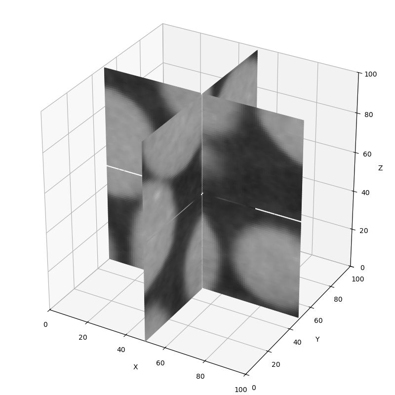
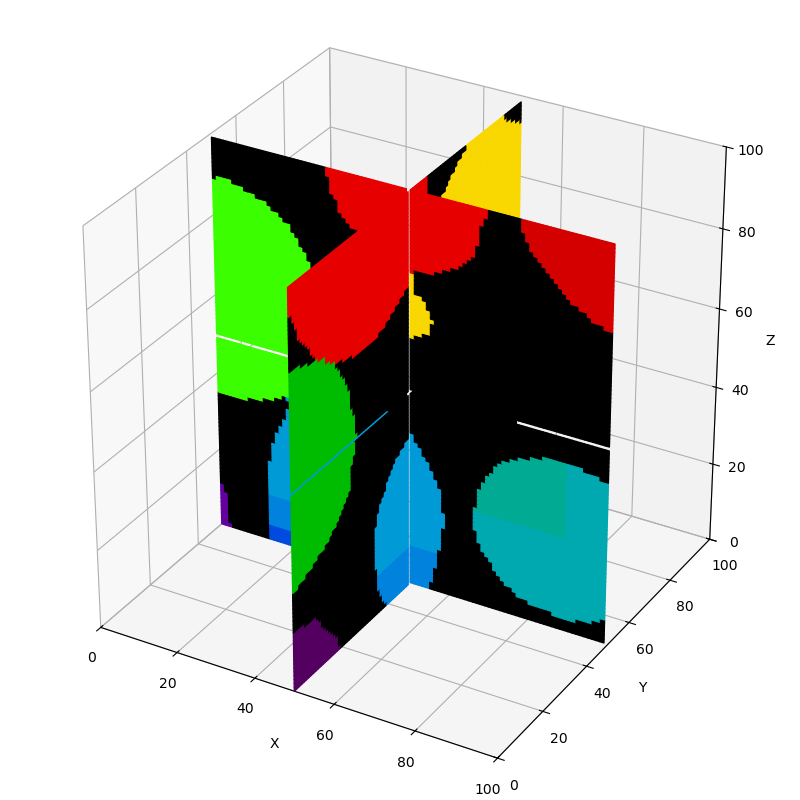

<!--
This README template is designed with dual purpose.

It should help you think about and plan various aspects of your
exemplar. In this regard, the document need not be completed in
a single pass. Some sections will be relatively straightforward
to complete, others may evolve over time.

Once complete, this README will serve as the landing page for
your exemplar, providing learners with an outline of what they
can expect should they engage with the work.

Recall that you are developing a software project and learning
resource at the same time. It is important to keep this in mind
throughout the development and plan accordingly.
-->


<!-- Your exemplar title. Make it sound catchy! -->
# Segmentation Lab

<!-- A brief description of your exemplar, which may include an image -->
This repository provides a from-scratch implementation of 3D image segmentation in Python, demonstrating both thresholding and marker-based watershed methods on real and synthetic volumetric data. Learners will explore the algorithmic logic, visualization, and reproducible coding practices behind modern segmentation workflows—bridging fundamental image processing with real-world applications. Two real datasets are included as examples:

A micro-CT image of spherical particles (materials science), and

A medical CT scan (biomedical imaging).

By working through this project, users will gain hands-on experience in building segmentation pipelines, visualizing 3D data, and evaluating performance metrics such as Dice and Jaccard scores—developing a solid foundation for applying and extending 3D segmentation in scientific and industrial domains.

Original Gray Scale Image             |  Segmented Image
:-------------------------:|:-------------------------:
  |  

<!-- Author information -->
This exemplar was developed at Imperial College London by David Büchner in
collaboration with Aurash Karimi from Research Software Engineering and
Jianliang Gao from Research Computing & Data Science at the Early Career
Researcher Institute.


<!-- Learning Outcomes. 
Aim for 3 - 4 points that illustrate what knowledge and
skills will be gained by studying your ReCoDE exemplar. -->
## Learning Outcomes 🎓

After completing this exemplar, students will:

1. Understand and implement 3D segmentation algorithms — build thresholding and watershed methods from first principles, and apply them to real volumetric datasets.

2. Develop practical data handling and visualization skills — load, process, and visualize 3D imaging data using NumPy, SciPy, and scikit-image, including interactive slice and 3D surface rendering.

3. Apply reproducible and modular coding practices — structure segmentation pipelines with clear, testable, and reusable Python functions.

4. Evaluate and interpret segmentation results — compute quantitative metrics (Dice, Jaccard) and relate algorithmic choices to image characteristics in materials and biomedical imaging contexts.


<!-- Audience. Think broadly as to who will benefit. -->
## Target Audience 🎯

Students and researchers in materials science, biomedical engineering, and computational imaging who want hands-on experience with 3D segmentation.


<!-- Requirements.
Before starting, learners should have:

- Basic proficiency in Python — including functions, loops, and file handling.

- Familiarity with NumPy for numerical array operations. (add ECRI course)

- Introductory understanding of image processing concepts (e.g., grayscale intensity, filtering, segmentation).

-->
## Prerequisites ✅

### Academic 📚

- Required skills/knowledge (e.g. programming languages, libraries, theory, courses)

### System 💻

- Python 3.11+, Anaconda, 2 GB disk space

<!-- Quick Start Guide. Tell learners how to engage with the exemplar. -->
## Getting Started 🚀

1. Run the main_pipeline.py script to execute the full 3D segmentation workflow — from data loading and preprocessing to segmentation, evaluation, and visualization.


<!-- Background. Tell learners about why this exemplar is useful. -->
## Disciplinary Background 🔬
     
This exemplar is inspired by my research on medical and micro-CT imaging of packed bed adsorbers used for CO₂ capture. Through imaging, we study how much and how fast materials absorb CO₂ — linking 3D structural information to material performance.

When I began this work, we relied heavily on prepared libraries such as scikit-image and commercial software. Over time, I realized that to truly extract insight from the data, I needed to customize algorithms and understand their logic from the ground up. Re-implementing methods like thresholding and watershed from scratch gave me a much deeper understanding of how segmentation actually works.

This is an experience that benefits anyone working with 3D imaging — providing not just technical skills, but also a fundamental grasp of the algorithms and assumptions that usually operate behind the scenes in high-level tools.


<!-- Software. What languages, libraries, software you use. -->
## Software Tools 🛠️

Pyhton, numpy, matplotlib, scikit-image


<!-- Repository structure. Explain how your code is structured. -->
## Project Structure 🗂️

Overview of code organisation and structure.

```
.
├── notebooks
│ ├── ex1.ipynb
├── src
│ ├── file1.py
│ ├── file2.cpp
│ ├── ...
│ └── data
├── docs
└── test
```

Code is organised into logical components:

- `notebooks` for tutorials and exercises
- `src` for core code, potentially divided into further modules
- `data` within `src` for datasets
- `docs` for documentation
- `test` for testing scripts


<!-- Roadmap.
Identify the project core (a minimal working example). This
is what you should develop first, ideally by week 6. Defining
a core helps ensure that, despite a tight timeline, we will end
up with a complete project.

Identify project extensions. These are additional features that
you will implement after the core of the project is finished; you
could also propose extensions as open-ended exercises for the ReCoDE
audience.

Outline the process of creating the exemplar as a project roadmap
with individual steps. This will help you with defining the scope of 
the project. When you think about this, imagine that you are explaining
it to a new PhD student. Assume that this student is from a related (but
not necessarily same) discipline. They can code but have never undertaken
a larger project. The steps should follow logical development of the
project and good practice. Each will be relatively independent and contain
its own learning annotation and links to other learning materials if
appropriate. The learning annotation is going to form a significant portion
of your efforts.

Learning annotations will evolve as we go along but planning now will be useful
in defining your exemplar steps. Remember that active learning is generally more
valuable than just reading information, so small exercises that build on previous
steps can really help your students to understand the software development process.
You can include videos, text, charts, images, flowcharts, storyboards, or anything
creative that you may think of.

Completed tasks are marked with an x between the square brackets.
-->
## Roadmap 🗺️

### Core 🧩

- [x] Data ingestion pipeline
    * [x] Tutorial with small data exercise
- [x] Core analysis algorithms
    * [x] Documentation with worked example
- [ ] Basic visualisation tools
    * [ ] Mini-project: "Create your first plot"
- [ ] Results export functionality
    * [ ] Usage tutorial with export task
    * [ ] Short video walkthrough *(planned)*
- [ ] Automated testing suite
    * [ ] Debugging challenge
- [ ] Documentation for core methods

### Extensions 🔌

- [ ] Advanced statistical models
    * [ ] Example notebook with exercises
- [ ] Interactive dashboard
    * [ ] Exercise: Build a simple component
- [ ] Multi-format data import/export
    * [ ] Guide with hands-on tasks
- [ ] Collaboration tools integration
    * [ ] Exercise: Set up collaborative workflow
    * [ ] Include diagram of workflow *(optional)*
- [ ] Extended visualisation options
    * [ ] Creative task: Design a custom plot

<!-- Data availability (remove this section if no data used) -->
## Data 📊

List datasets used with:

- Licensing info
- Where they are included (in the repo or external links)


<!-- Best practice notes. -->
## Best Practice Notes 📝

- Code testing and/or test examples
- Use of continuous integration (if any)
- Any other software development best practices

<!-- Estimate the time it will take for a learner to progress through the exemplar. -->
## Estimated Time ⏳

| Task       | Time    |
| ---------- | ------- |
| Reading    | 3 hours |
| Practising | 3 hours |


<!-- Any references, or other resources. -->
## Additional Resources 🔗

- Relevant sources, websites, images, AOB.

<!-- LICENCE.
Imperial prefers BSD-3. Please update the LICENSE.md file with the current year.
-->
## Licence 📄

This project is licensed under the [BSD-3-Clause license](LICENSE.md).
